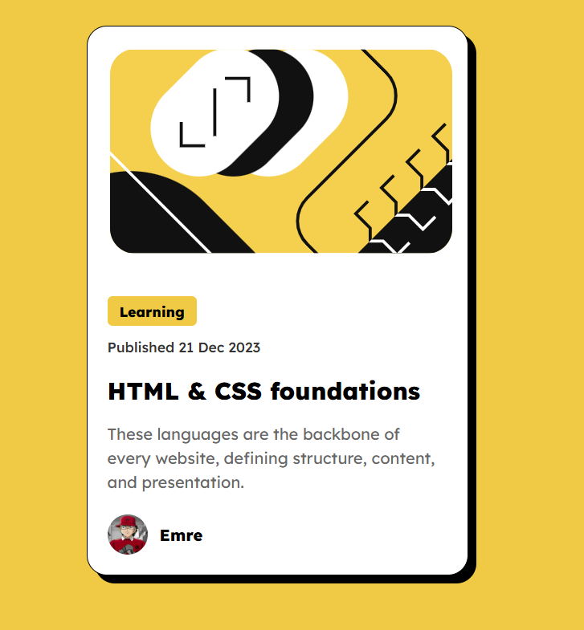

# QR Code Component



## About The Project

This is a solution to the [ Blog Preview Card challenge](https://www.frontendmentor.io/challenges/blog-preview-card-ckPaj01IcS) on Frontend Mentor. Frontend Mentor challenges help you improve your coding skills by building realistic projects.

A clean and modern blog preview card component featuring a article illustration, tags, publication date, and author information.

## Built With

- HTML5
- CSS3
- Flexbox
- Google Fonts (Lexend)

## Features

-  Fully responsive design
-  Hover effects on title and links
-  Clean and minimal design
-  Optimized images for all screen sizes
-  Semantic HTML structure

## Live Demo

[View Live Demo](https://emre-44.github.io/frontend-mentor-projects/blog-preview-card)

## Getting Started

To get a local copy up and running, follow these steps:

1. Clone the repository
    ```sh
    git clone https://github.com/emre-44/blog-preview-card.git

2. Navigate to the project folder
    ```sh
    cd blog-preview-card

3. Open index.html in your browser or use Live Server