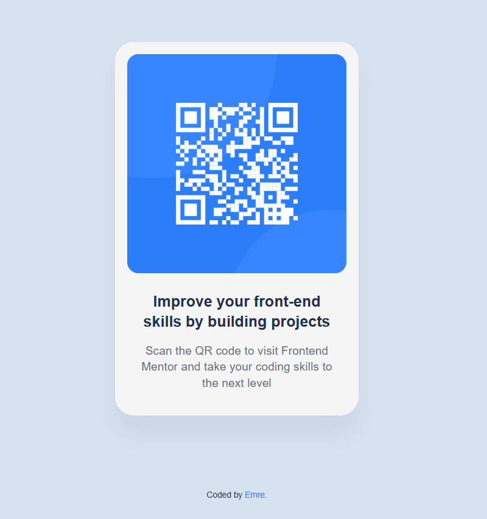

# QR Code Component



## About The Project

This is a solution to the [ QR code component challenge](https://www.frontendmentor.io/challenges/qr-code-component-iux_sIO_H) on Frontend Mentor. Frontend Mentor challenges help you improve your coding skills by building realistic projects.

A simple and clean QR code card component. Users can scan the QR code to visit Frontend Mentor website.

## Built With

- HTML5
- CSS3
- Flexbox
- Google Fonts (Inter)

## Features

- Responsive design (mobile and desktop)
- Centered card layout
- Clean and minimal design
- Optimized for all screen sizes

## Live Demo

[View Live Demo]((https://emre-44.github.io/frontend-mentor-projects/qr-code-component))

## Getting Started

To get a local copy up and running, follow these steps:

1. Clone the repository
    ```sh
    git clone https://github.com/emre-44/qr-code-component.git

2. Navigate to the project folder
    ```sh
    cd qr-code-component

3. Open index.html in your browser or use Live Server